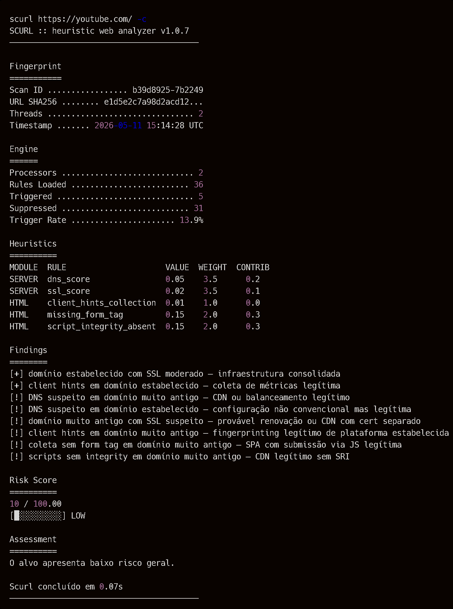

# **SCURL** é um scanner baseado em análise heurística e estatística capaz de estimar o risco de URLs potencialmente maliciosas.

Ao invés de depender exclusivamente de listas de bloqueio, o SCURL analisa:

- estrutura da URL
- comportamento HTTP
- metadados DNS
- certificados SSL
- sinais contextuais
- padrões de infraestrutura

para produzir um score de risco entre `0` e `100`.

O motor heurístico permite detectar padrões suspeitos mesmo em URLs nunca vistas anteriormente.

---

# Índice

- [Estatísticas e diversos](#estatísticas-e-diversos)
- [Features](#features)
- [Instalação](#instalação)
- [Uso](#uso)
  - [CLI](#cli)
  - [API](#api)
- [Documentação](#documentação)
- [Limitações](#limitações)
- [Licença](#licença)
- [Contribuições](#contribuições)

# Estatísticas e diversos.


[](https://www.python.org/)
[](https://github.com/JuaanReis/scurl) &nbsp;
[](https://github.com/JuaanReis/scurl/pulls) &nbsp;
[](https://github.com/JuaanReis/scurl/commits/main) &nbsp;
[](https://www.youtube.com/watch?v=dQw4w9WgXcQ) &nbsp;
[](https://www.youtube.com/watch?v=QwLvrnlfdNo)

# Features

- análise estrutural de URLs
- detecção de typosquatting
- análise heurística contextual
- scoring probabilístico
- resolução de dependências entre sinais
- análise DNS
- análise SSL/TLS
- detecção de phishing patterns
- análise HTML
- cache SQLite
- API REST
- CLI formatada
- exportação JSON
- execução paralela
- integração com Google Safe Browsing

# Instalação

Requer **Python 3.11+**.

```bash
git clone https://github.com/JuaanReis/scurl.git
cd scurl
pip install -e .
```

Após a instalação, `scurl` e `scurl-api` estarão disponíveis no ambiente.

Crie um arquivo `.env` na raiz do projeto:

```env
GOOGLE_SAFE_BROWSING_KEY=sua_chave
SCURL_DB_PATH=./providers/database/storage/scurl.db
```

A heurística `safe_browsing` é desativada automaticamente se nenhuma chave for fornecida.

# Uso

## *CLI*

O ponto de entrada principal é `-u`, que recebe a URL alvo. As flags disponíveis são:

| Flag | Descrição |
|------|-----------|
| `-u` | URL alvo (obrigatório) |
| `-v` | Saída detalhada com breakdown por heurística |
| `-o` | Exporta o resultado em JSON para o arquivo especificado |
| `-c` | Reutiliza cache SQLite se a URL já foi analisada anteriormente |

> *Abaixo é um exemplo de saída de uma run comum.*



> *_Esse é um exemplo de saída detalhada. O score final é `10`, com contribuições de várias heurísticas. O breakdown mostra quais sinais foram observados e como eles impactaram o score._*

## *API*

Inicie o servidor com `scurl-api`. Por padrão sobe em `http://localhost:8000`, com documentação interativa disponível em `http://localhost:8000/docs` (Swagger UI).

```bash
scurl-api
```

### Exemplo de request

```bash
curl -X POST http://localhost:8000/analyze \
  -H "Content-Type: application/json" \
  -d '{"url":"http://www.exemp1o.com/results?user=i123"}'
```

# Documentação

| Documento | Descrição |
|-----------|-----------|
| [`docs/architecture.md`](./docs/architecture.md) | arquitetura interna do motor |
| [`docs/heuristics.md`](./docs/heuristics.md) | heurísticas e categorias |
| [`docs/scoring.md`](./docs/scoring.md) | sistema de scoring |
| [`docs/calibration.md`](./docs/calibration.md) | calibração e limitações |
| [`docs/CLI.md`](./docs/CLI.md) | flags e uso da CLI |
| [`docs/API.md`](./docs/API.md) | endpoints REST |


# Limitações

O SCURL é um sistema heurístico, não determinístico. Os scores refletem probabilidade de risco com base em sinais observáveis — não confirmação de malícia. Falsos positivos e falsos negativos são esperados, especialmente em domínios legítimos com infraestrutura atípica (ex: CDNs, provedores de DNS compartilhado).

O motor opera exclusivamente sobre dados de rede e estrutura da URL. Ele não executa JavaScript, não renderiza páginas e não simula comportamento de browser. Ataques que dependem de conteúdo dinâmico ou client-side podem não ser detectados.

Parte da análise depende de serviços externos (DNS, SSL, Google Safe Browsing), sujeitos a latência, indisponibilidade ou rate limiting.

Mais detalhes em [`docs/calibration.md`](./docs/calibration.md).

# Licença
> O projeto é aberto sob a licença MIT, permitindo uso, modificação e distribuição livre. O código-fonte é disponibilizado sem garantias, e os autores não se responsabilizam por quaisquer danos decorrentes do uso do software. Para mais informações, consulte o arquivo de licença incluído no repositório. <br><br>
> Não use o SCURL em sites ou domínios que você não possui ou tem permissão explícita para testar. O uso não autorizado pode ser ilegal e antiético. Sempre obtenha consentimento antes de analisar URLs que não são de sua propriedade.

MIT License. Veja [LICENSE](./LICENSE) para detalhes.

# Contribuições
Sinta-se livre para contribuir com melhorias, correções de bugs ou novas heurísticas. Pull requests são bem-vindos.

> Mais detalhes em [CONTRIBUTING](./CONTRIBUTING.md).

---

Desenvolvido por [Juan](https://github.com/JuaanReis).