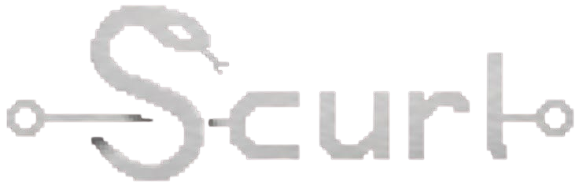

<p align="center">
  
</p>

---

<h3 align="center">
  Structural and contextual URL risk locator
</h3>

<p align="center">
 Detecte URLs suspeitas usando heurísticas estruturais, comportamentais e baseadas em infraestrutura
</p>

<p align="center">
  
  
  
</p>

<p align="center">
  
</p>

# Instalação

Requer **Python 3.11+**.

```bash
git clone https://github.com/JuaanReis/scurl.git
cd scurl
pip install -e .
```

Após a instalação, `scurl` e `scurl-api` estarão disponíveis no ambiente.

Crie um arquivo `.env` na raiz do projeto:

```env
GOOGLE_SAFE_BROWSING_KEY=sua_chave
SCURL_DB_PATH=./providers/database/storage/scurl.db
```

A heurística `safe_browsing` é desativada automaticamente se nenhuma chave for fornecida.

# Uso

## *CLI*

O ponto de entrada principal é `-u`, que recebe a URL alvo. As flags disponíveis são:

| Flag | Descrição |
|------|-----------|
| `-u` | URL alvo (obrigatório) |
| `-v` | Saída detalhada com breakdown por heurística |
| `-o` | Exporta o resultado em JSON para o arquivo especificado |
| `-c` | Reutiliza cache SQLite se a URL já foi analisada anteriormente |

## *API*

Inicie o servidor com `scurl-api`. Por padrão sobe em `http://localhost:8000`, com documentação interativa disponível em `http://localhost:8000/docs` (Swagger UI).

```bash
scurl-api
```

### Exemplo de request

```bash
curl -X POST http://localhost:8000/analyze \
  -H "Content-Type: application/json" \
  -d '{"url":"http://www.exemp1o.com/results?user=i123"}'
```

# Documentação

| Documento | Descrição |
|-----------|-----------|
| [`docs/architecture.md`](./docs/architecture.md) | arquitetura interna do motor |
| [`docs/heuristics.md`](./docs/heuristics.md) | heurísticas e categorias |
| [`docs/scoring.md`](./docs/scoring.md) | sistema de scoring |
| [`docs/calibration.md`](./docs/calibration.md) | calibração e limitações |
| [`docs/installation.md`](./docs/INSTALLATION.md) | Instalação e uso |
| [`docs/CLI.md`](./docs/CLI.md) | flags e uso da CLI |
| [`docs/API.md`](./docs/API.md) | endpoints REST |

# Licença

MIT License. Veja [LICENSE](./LICENSE) para detalhes.

> [!WARNING]
> Não use o SCURL em domínios que você não possui ou tem permissão explícita para testar. Uso não autorizado pode ser ilegal. Sempre obtenha consentimento antes de analisar URLs de terceiros.

# Contribuições
Sinta-se livre para contribuir com melhorias, correções de bugs ou novas heurísticas. Pull requests são bem-vindos.

> Mais detalhes em [CONTRIBUTING](./CONTRIBUTING.md).

---

Desenvolvido por [Juan T. Reis](https://github.com/JuaanReis).